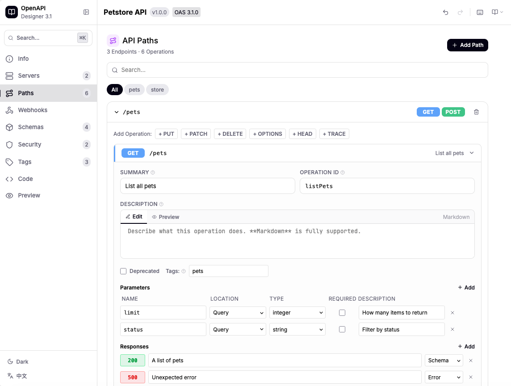

<div align="center">

# OpenAPIDesigner

[](https://www.npmjs.com/package/@xcan-cloud/open-api-designer)
[](https://react.dev/)
[](https://tailwindcss.com/)
[](./LICENSE)

基于 React 构建的可视化 OpenAPI 3.1 规范设计器。在一个组件中完成 API 文档的设计、编辑和预览。

[English](./README.md) · [简体中文](./README.zh-CN.md) · [在线演示](https://xcancloud.github.io/OpenAPIDesigner/) · [文档](./website/)

<br />



<br />

</div>

---

## 目录

- [功能特性](#功能特性)
- [快速开始](#快速开始)
- [API 参考](#api-参考)
- [导出工具函数](#导出工具函数)
- [组件架构](#组件架构)
- [子项目](#子项目)
- [自定义](#自定义)
- [技术栈](#技术栈)
- [浏览器支持](#浏览器支持)
- [参与贡献](#参与贡献)
- [许可证](#许可证)

## 功能特性

- **可视化编辑器** — 通过直观的界面设计 API 端点、Schema、参数和响应
- **代码编辑器** — 内置支持语法高亮的 YAML/JSON 编辑器
- **双向同步** — 可视化编辑器与代码编辑器自动保持同步
- **Schema 设计器** — 完整的 JSON Schema 支持，包括 `oneOf`、`allOf`、`anyOf` 和 `not`
- **安全方案** — OAuth2、JWT、API Key、HTTP Basic、OpenID Connect、双向 TLS
- **实时校验** — 基于 OpenAPI 3.1 规范的实时验证
- **API 文档预览** — Swagger UI 风格的文档预览
- **导入 / 导出** — 支持 YAML 和 JSON 格式的规范文件加载与保存
- **国际化** — 内置中文和英文支持
- **主题切换** — 深色和浅色主题无缝切换
- **撤销 / 重做** — 所有编辑操作支持完整的历史记录
- **标签管理** — 使用标签对端点进行分组管理
- **命令面板** — 通过键盘快捷键快速导航和执行操作

## 快速开始

### 安装

```bash
npm install @xcan-cloud/open-api-designer
```

### 基本用法

```tsx
import { OpenAPIDesigner } from '@xcan-cloud/open-api-designer';

function App() {
  return (
    <OpenAPIDesigner
      defaultLocale="zh"
      defaultTheme="light"
      onChange={(doc) => console.log(doc)}
    />
  );
}
```

### 使用示例文档

```tsx
import { OpenAPIDesigner, createPetStoreDocument } from '@xcan-cloud/open-api-designer';

function App() {
  return (
    <OpenAPIDesigner
      initialDocument={createPetStoreDocument()}
      onChange={(doc) => console.log(doc)}
    />
  );
}
```

## API 参考

### `<OpenAPIDesigner />` 属性

| 属性 | 类型 | 默认值 | 说明 |
| --- | --- | --- | --- |
| `initialDocument` | `OpenAPIDocument` | `undefined` | 挂载时加载的预填充 OpenAPI 文档 |
| `defaultLocale` | `'zh' \| 'en'` | `'en'` | 界面语言 |
| `defaultTheme` | `'light' \| 'dark'` | `'light'` | 颜色主题 |
| `onChange` | `(doc: OpenAPIDocument) => void` | `undefined` | 文档每次变更时触发的回调函数 |
| `className` | `string` | `undefined` | 附加到根元素的 CSS 类名 |

### TypeScript 接口

```tsx
interface OpenAPIDesignerProps {
  initialDocument?: OpenAPIDocument;
  defaultLocale?: 'zh' | 'en';
  defaultTheme?: 'light' | 'dark';
  onChange?: (doc: OpenAPIDocument) => void;
  className?: string;
}
```

## 导出工具函数

| 函数 | 说明 |
| --- | --- |
| `createDefaultDocument()` | 返回一个最小化的、有效的 OpenAPI 3.1 文档 |
| `createPetStoreDocument()` | 返回一个功能丰富的 Pet Store 示例文档 |

## 组件架构

```
┌──────────────────────────────────────────────────┐
│                 OpenAPIDesigner                   │
│                                                  │
│  ┌─────────────┐  ┌───────────────────────────┐  │
│  │  工具栏      │  │  命令面板                  │  │
│  └─────────────┘  └───────────────────────────┘  │
│                                                  │
│  ┌──────────────────┬───────────────────────┐    │
│  │  可视化编辑器     │   代码编辑器           │    │
│  │                  │   (YAML / JSON)       │    │
│  │  • 路径          │                       │    │
│  │  • Schema        │                       │    │
│  │  • 参数          ◄──── 双向同步 ────────►│    │
│  │  • 响应          │                       │    │
│  │  • 安全方案      │                       │    │
│  │  • 标签          │                       │    │
│  └──────────────────┴───────────────────────┘    │
│                                                  │
│  ┌──────────────────┬───────────────────────┐    │
│  │  校验面板        │  文档预览              │    │
│  └──────────────────┴───────────────────────┘    │
└──────────────────────────────────────────────────┘
```

## 子项目

| 目录 | 说明 |
| --- | --- |
| [`example/`](./example/) | 展示组件用法的示例演示应用 |
| [`website/`](./website/) | 包含使用指南和 API 文档的文档站点 |

## 自定义

### 加载自定义文档

```tsx
const myDoc: OpenAPIDocument = {
  openapi: '3.1.0',
  info: { title: 'My API', version: '1.0.0' },
  paths: {},
};

<OpenAPIDesigner initialDocument={myDoc} />;
```

### 添加语言

内置的国际化系统支持中文（`zh`）和英文（`en`）。如需贡献新的语言：

1. 在 `src/app/components/openapi-designer/i18n/` 下创建新的语言文件。
2. 复制已有的语言文件（如 `en.ts`），并翻译所有键值。
3. 在国际化配置中注册新语言。
4. 提交 Pull Request。

## 技术栈

| 类别 | 技术 |
| --- | --- |
| 框架 | React 18、TypeScript |
| 样式 | Tailwind CSS v4 |
| UI 组件 | Radix UI (shadcn/ui) |
| 图标 | Lucide React |
| YAML 处理 | js-yaml |
| 构建工具 | Vite |

## 浏览器支持

| 浏览器 | 支持版本 |
| --- | --- |
| Chrome | 最近 2 个版本 |
| Firefox | 最近 2 个版本 |
| Safari | 最近 2 个版本 |
| Edge | 最近 2 个版本 |

## 参与贡献

欢迎贡献！请按以下步骤操作：

1. Fork 本仓库。
2. 创建功能分支：`git checkout -b feat/my-feature`。
3. 提交更改：`git commit -m 'feat: add my feature'`。
4. 推送分支：`git push origin feat/my-feature`。
5. 发起 Pull Request。

提交前请确保代码通过现有的 Lint 检查和构建。

## 许可证

[MIT](./LICENSE) © OpenAPIDesigner Contributors
